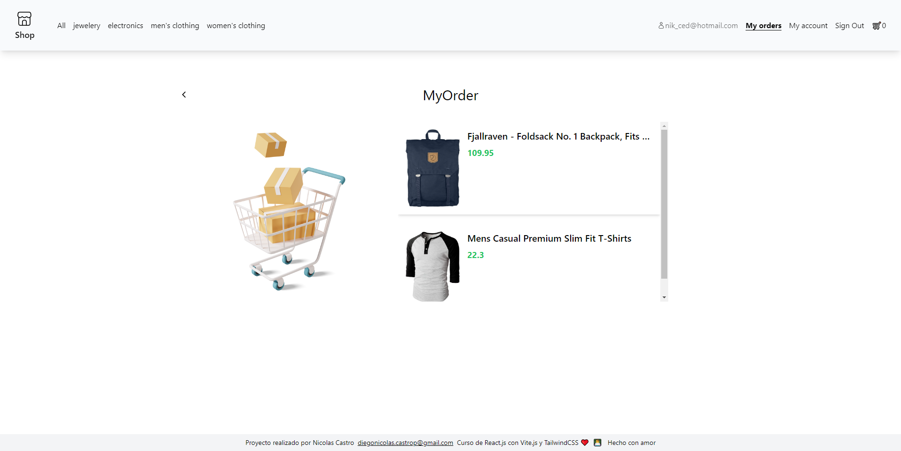

# Ecommerce Vite + React + Tailwind

This project is an eCommerce website developed using Vite, React, and styled with Tailwind CSS. The application includes features such as category filters, product details in a modal, API consumption, shopping cart persistence, deletion and summing in the total, order management, and individual order details.

## Demo

You can explore the live eCommerce store [here](https://nicolascastro77.github.io/ecommerce-vite-tailwind/).

## Screenshots

    
    

    
    

    
    

## Features

- **Category Filters:** Allows users to filter products by category.
- **Product Details in Modal:** Displays comprehensive product details in a modal on click.
- **API Consumption:** Uses an external API to fetch product information.
- **Shopping Cart Persistence:** Stores selected products in the cart even on page reload.
- **Deletion and Summing in Total:** Enables users to remove products from the cart and automatically updates the total.
- **Order Management:** Provides functions to manage orders and view individual details.

## Technologies Used

- **Vite:** Rapid development tool for modern web projects.
- **React:** JavaScript library for building user interfaces.
- **Tailwind CSS:** Usable and customizable design framework.
- **Hooks, useEffect, useStates, createContext:** Widely used for state management and application logic.

## Installation and Usage

1. Clone the repository: `git clone https://github.com/nicolascastro77/ecommerce-vite-tailwind.git`
2. Install dependencies: `npm install`
3. Start the application: `npm run dev`
